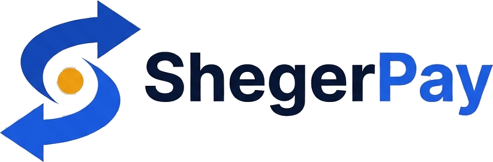

# ShegerPay WooCommerce Plugin

Accept Ethiopian bank payments (CBE, Telebirr, BOA, Awash) in your WooCommerce store — automatic verification, no manual checking.

## What it does
- Adds **"Pay with Ethiopian Bank"** at WooCommerce checkout
- Customer enters their transaction ID after sending payment
- Plugin calls ShegerPay API and auto-verifies in real time
- Order marked **complete** automatically on success

## Install

### Option 1 — Upload zip (easiest)
1. [Download latest release](https://github.com/shegerpay/sdk-wordpress/releases)
2. WordPress Admin → **Plugins → Add New → Upload Plugin**
3. Activate

### Option 2 — Manual
Copy `shegerpay-woocommerce/` into your `wp-content/plugins/` directory and activate.

## Configure
**WooCommerce → Settings → Payments → ShegerPay**
- Enable the gateway
- Paste your API key (`sk_live_...` for production, `sk_test_...` for testing)
- Write payment instructions for customers
- Save

Get your API key free at [shegerpay.com](https://shegerpay.com)

## Requirements
- WordPress 6.0+
- WooCommerce 6.0+
- PHP 7.4+

## Supported Banks
CBE · Telebirr · BOA (Bank of Abyssinia) · Awash Bank

## Support
- Docs: https://shegerpay.com/docs
- Telegram: https://t.me/shegerpay_0
- Email: support@shegerpay.com
